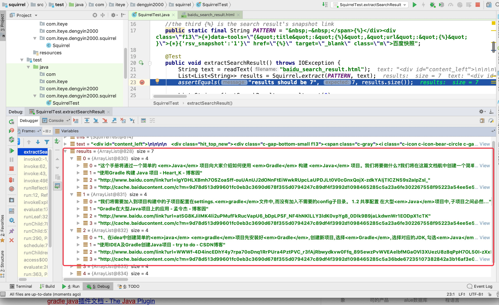

# Squirrel text extractor
> A simple util for extracting strings from a huge text.    

## Table of contents
* [General info](#general-info)
* [Get started](#get-started)
* [Contact](#contact)

## General info

> We always use regex expression for extracting strings, but regex expression is hard to learn. This is a very easy util for  extracting strings from a huge text.     
    
For example, this is a search result, we want to extract the search results.  


The following is our extract result.



## Get started
All you need is defining the extract pattern, and for the pattern, all you need to know is ** are any characters you want to extract.
2. {*} are any characters you want to omit.

```java
public static final String PATTERN = "&nbsp;-&nbsp;</span>&quot;,&quot;url&quot;:&quot;\" target=\"_blank\" class=\"m\">百度快照";
```
The extracting will traverse all text, and match the pattern. Finally, you should invoke the following method to extract strings.

```java
        String text = readText("baidu_search_result.html");
        List<List<String>> results = Squirrel.extract(PATTERN, text);

```

Please see the unit test for details.

## Contact
Created by [@deng.yin@gmail.com](https://www.jianshu.com/u/efa51344ce61) - feel free to contact me!